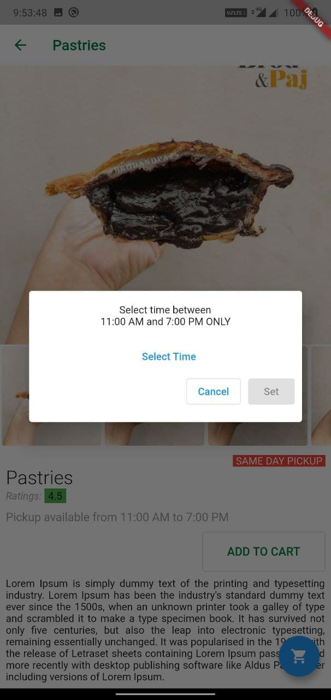
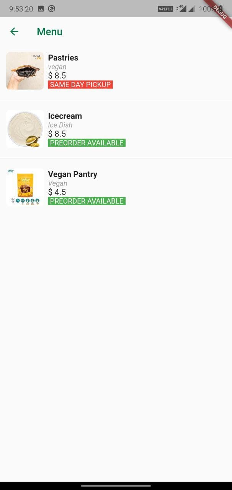

<!-- PROJECT LOGO -->

  <h3 align="center">Nearby Resto Locator</h3>
  

    Locate nearby restaurant based on user data

<!-- ABOUT THE PROJECT -->
## About The Project

### Built With

* Flutter
* Firebase
* Geolocator

## Screenshots

  
  
 

 

   
  
  

<!-- CONTACT -->
## Contact

Your Name - [@sohil_bhanani](https://twitter.com/sohil_bhanani) - sbhananis@gmail.com

Project Link: [https://github.com/SohilBhanani/nearby_resto_locator](https://github.com/SohilBhanani/nearby_resto_locator)

[product-screenshot]: images/screenshot.png
